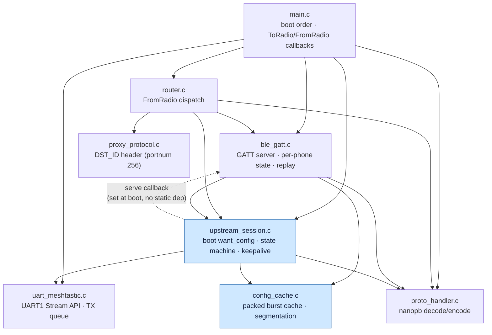
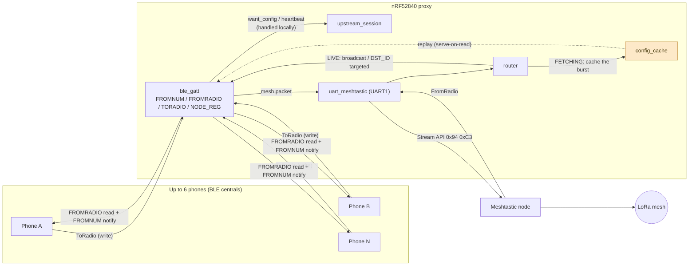
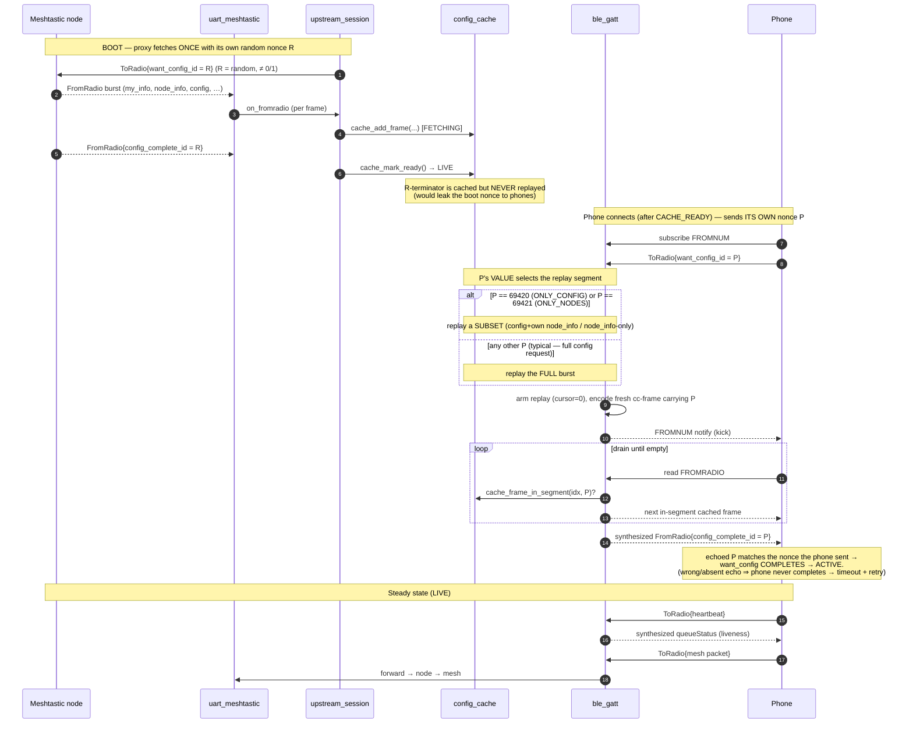
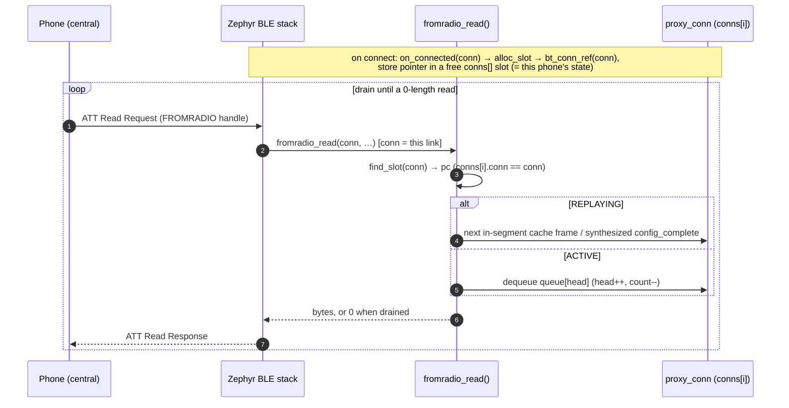
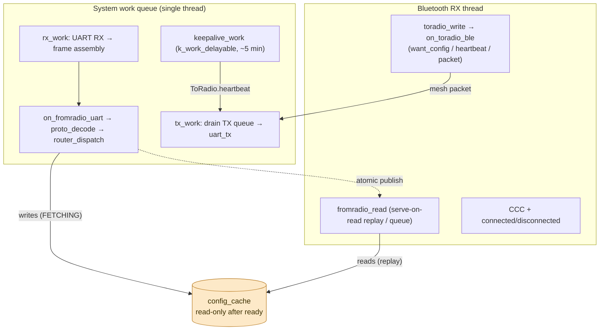
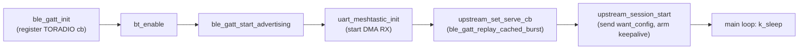

# Architecture — Meshtastic BLE Proxy (nRF52840 / Zephyr)

This document audits the embedded software: module structure, data flow, the two
state machines, the `want_config` handshake sequence, the threading model, and the
boot order. Diagrams are Mermaid (render natively on GitHub and in the IDE).

The firmware turns one Meshtastic node into a **6-phone BLE front end**. Each phone
gets a connection that behaves like a standalone 1:1 Meshtastic link, while the proxy
arbitrates the single shared UART link to the node.

---

## 1. Module dependency graph

Who calls/includes whom (`src/`). `upstream_session` deliberately has **no** compile
dependency on `ble_gatt` — the per-phone replay is reached through a registered
callback (dependency inversion).

- Pure / leaf modules (no intra-project deps): `proto_handler`, `proxy_protocol`,
  `uart_meshtastic`, `config_cache`.
- The dashed edge is the runtime callback `upstream_set_serve_cb(ble_gatt_replay_cached_burst)`
  registered by `main` at boot — keeps the layering clean (upstream → ble_gatt only at runtime).

---

## 2. Data flow (BLE ↔ UART)

**Two delivery modes in LIVE** (`router.c`):
- **Broadcast** — standard Meshtastic portnums → all connections (stock app works).
- **Targeted** — `portnum == PROXY_PORTNUM (256)` → parse the proxy header, deliver to
  the connection whose registered `proxy_id` matches `DST_ID`; broadcast fallback if
  unregistered (no silent drop).

---

## 3. State machines

### 3a. State machines — upstream session + per-phone connection (unified)

The two state machines that drive onboarding, shown together: the **global upstream
session** (`upstream_session.c`, one instance — `BOOT → FETCHING → CACHE_READY → LIVE`)
and the **per-phone connection** machine (`ble_gatt.c`, one per BLE connection, up to 6 —
`CONNECTED → AWAIT_WANT_CONFIG → {PENDING} → REPLAYING → ACTIVE`).

  

<em>Figure 3a — left: the single upstream session that fetches the node config once into the shared cache. Right: the per-phone machine; a phone that connects before the cache is ready waits in <code>PENDING</code> and is served automatically once the upstream reaches LIVE.</em>

**Two `want_config` rounds.** The phone may run **two `want_config` rounds** with special
nonces — `69420` (ONLY_CONFIG) then `69421` (ONLY_NODES) — each re-arming `REPLAYING`
with a nonce-specific cache segment.

**The `config_complete_id` terminator.** In the Meshtastic protocol,
`FromRadio{config_complete_id = N}` is the **terminator** of a `want_config` burst. The
client treats it as "the config download keyed by nonce `N` is now complete." A phone
that sent `want_config_id = P` is specifically waiting for a `config_complete_id` equal to
`P` — that is its signal to leave the config-download state and go `ACTIVE`. The proxy
therefore never replays the cached terminator (it carries the proxy's boot nonce `R`); it
**synthesizes** a fresh one carrying each phone's own `P` (see §4).

### 3b. System lifecycle — transient vs steady state

The whole system goes through a **transient** phase (boot configuration + connection
setup) before settling into a **steady** phase where text messaging flows naturally.
§3a is the precise per-machine view; this is the system-level overview.

- **TRANSIENT** = the proxy fetches the node's config once, then each phone connects and
  runs its `want_config` handshake (config round `69420` → node-DB round `69421`). These
  are state-changing, one-time-per-(boot / connection) flows — the detailed mechanics live
  in the §3a machines.
- **STEADY** = `OPERATIONAL`: no state changes — the self-loops are the recurring,
  event-driven message flows (UART RX callbacks delivering text/telemetry → routed BLE
  notifications; phone writes → UART → mesh; liveness). This is the "stationary" regime.

  

<em>Figure 3b — the steady (<code>OPERATIONAL</code>) regime: recurring, event-driven flows once the cache is LIVE and the phone is ACTIVE. (TODO: this figure still omits the broadcast path — node FromRadio fanned out to all connected phones.)</em>

Notes:
- A phone connecting **before** the cache is ready waits as `PENDING` (§3a) inside the
  transient phase, then onboards automatically once the upstream reaches LIVE.
- Concurrency: the upstream session is global (one); the per-phone machine is
  per-connection (up to 6); they overlap in time. The happy-path ordering holds because a
  real phone simply can't finish onboarding until the cache exists.
- Leaving STEADY → TRANSIENT is per-phone and local: one phone re-running `want_config`
  (or reconnecting) re-enters its onboarding without disturbing the others or the node.

---

## 4. `want_config` handshake + boot fetch (sequence)

**Nonce roles (the key idea):**
- **R** — the proxy's own boot nonce. Used *once*, proxy→node, to build the shared cache. Never seen by a phone.
- **P** — each phone's own nonce. Never reaches the node. It has exactly two jobs: (1) its **value** selects the replay segment — `69420`/`69421` request a subset, *any other value* gets the full burst; (2) it is **echoed back** verbatim in the synthesized `config_complete_id` so the phone recognizes the burst as the answer to *its* request and completes its `want_config` state machine.

`config_complete_id` is **never cached** — it is the terminator; the replay synthesizes
a fresh one carrying each phone's own nonce `P`.

> The real Meshtastic Android client typically runs **two** rounds — `want_config(69420)`
> then `want_config(69421)` — to fetch config and the node DB separately (see §3a/§3b).
> Both are just specific values of `P`; a client issuing a single arbitrary nonce would
> instead receive the full burst in one round.

### 4b. FROMRADIO read → per-connection drain

How a phone's ATT reads resolve to its own queue. The `conn` is provided by the BLE
stack (it knows which link the read arrived on); `find_slot(conn)` maps it to that
phone's `proxy_conn` by **pointer identity** — `bt_conn_ref()` is just refcounting, it
assigns no id.

Different phones hold different `conn` pointers → different `pc` → **independent queues
drained in parallel**. That pointer-keyed mapping is the whole basis of the multiplexing.

---

## 5. Threading model

Two execution contexts; `config_cache` is published across them by a Zephyr `atomic_t`
release/acquire barrier (`cache_mark_ready` / `cache_is_ready`), so no mutex is needed
for the read-only cache. The per-connection FROMRADIO queue is guarded by a per-`conn`
`k_mutex`.

**Invariant:** all cache **writes** happen on the system work queue during `FETCHING`;
**reads** (per-phone replay) happen on the BT RX thread but only after `cache_is_ready()`
returns true. `k_work_delayable` (not `k_timer`) is used for the keepalive precisely so
it runs in work-queue context and may touch the UART safely.

---

## 6. Boot sequence (`main.c`)

Order matters: GATT is registered before `bt_enable`; the serve callback is registered
before `upstream_session_start` so a PENDING phone can be served the moment the cache is
ready.

---

## 7. Module reference

| File | Responsibility | Context |
|---|---|---|
| `main.c` | Boot order; `on_toradio_ble` (local handling of want_config/heartbeat, forward packets, reschedule keepalive); `on_fromradio_uart` | BT RX + work queue |
| `ble_gatt.c/.h` | GATT service (FROMNUM/FROMRADIO/TORADIO/LOGRADIO/NODE_REG), per-phone state, serve-on-read replay, synthesized queueStatus | BT RX |
| `uart_meshtastic.c/.h` | UART1 async/DMA, Stream API framing (`0x94 0xC3 len_hi len_lo`), RX state machine, TX queue | work queue |
| `proto_handler.c/.h` | nanopb decode (FromRadio/ToRadio) + encoders (config_complete / heartbeat / queueStatus) | both (stack-local encode) |
| `proxy_protocol.c/.h` | Custom proxy header parse/build (VERSION/SRC/DST/content), `PROXY_PORTNUM 256` | pure |
| `router.c/.h` | FromRadio dispatch: FETCHING→cache, LIVE→broadcast / DST_ID targeted; keepalive queueStatus swallow | work queue |
| `config_cache.c/.h` | Packed contiguous arena + index of the boot burst; per-nonce segmentation; atomic ready barrier; queueStatus lookup | written on WQ, read on BT RX |
| `upstream_session.c/.h` | Boot `want_config`, BOOT→FETCHING→CACHE_READY→LIVE, Phase 0 instrumentation, UART keepalive | work queue |

## 8. Key invariants (audit checklist)

- **Serve-on-read replay** — one cached frame per FROMRADIO read; never pre-enqueue the
  burst (would overflow the 8-deep per-conn queue).
- **`cache_mark_ready()` is a release barrier** — readers seeing `cache_is_ready()` see
  the fully-written arena.
- **Burst order preserved**; `config_complete_id` synthesized per phone, never cached.
- **want_config / heartbeat never reach UART**; only mesh packets do.
- **Keepalive** fires only after ~5 min of no real ToRadio (rescheduled on each real TX),
  nonce ≠ 1; its queueStatus reply is swallowed in `router`.
- **No silent drops** — overflow / unregistered DST_ID fall back to broadcast and log.

> Companion: firmware design rationale in the studio's `ADR-001`. Phone-app integration
> (broadcast vs router, NODE_REG, portnum-256 framing) in `client-integration.md`.
