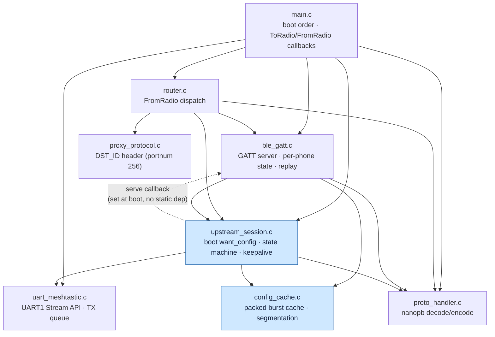
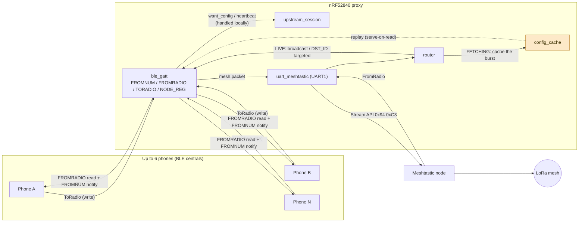
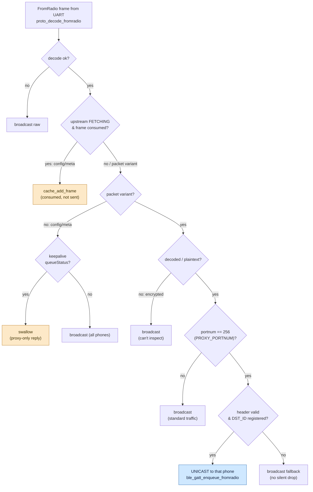
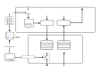
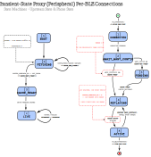
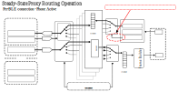
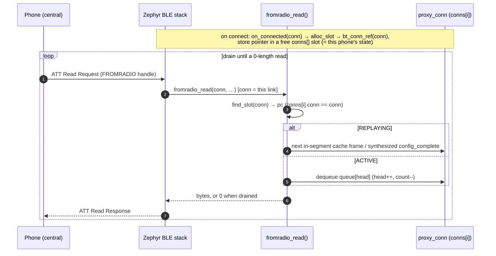
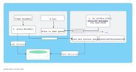
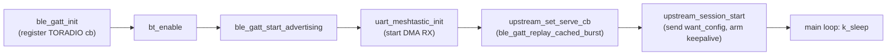

# Architecture — Meshtastic BLE Proxy (nRF52840 / Zephyr)

This document audits the embedded software: module structure, data flow, the two
state machines, the `want_config` handshake sequence, the threading model, and the
boot order. Diagrams are Mermaid (render natively on GitHub and in the IDE).

The firmware turns one Meshtastic node into a **6-phone BLE front end**. Each phone
gets a connection that behaves like a standalone 1:1 Meshtastic link, while the proxy
arbitrates the single shared UART link to the node.

---

## 1. Module dependency graph

Who calls/includes whom (`src/`). `upstream_session` deliberately has **no** compile
dependency on `ble_gatt` — the per-phone replay is reached through a registered
callback (dependency inversion).



- Pure / leaf modules (no intra-project deps): `proto_handler`, `proxy_protocol`,
  `uart_meshtastic`, `config_cache`.
- The dashed edge is the runtime callback `upstream_set_serve_cb(ble_gatt_replay_cached_burst)`
  registered by `main` at boot — keeps the layering clean (upstream → ble_gatt only at runtime).

---

## 2. Data flow (BLE ↔ UART)



**Two delivery modes in LIVE** (`router.c`):
- **Broadcast** — standard Meshtastic portnums → all connections (stock app works).
- **Targeted** — `portnum == PROXY_PORTNUM (256)` → parse the proxy header, deliver to
  the connection whose registered `proxy_id` matches `DST_ID`; broadcast fallback if
  unregistered (no silent drop).

### 2a. Router dispatch decision tree (`router.c`)

Every `FromRadio` frame arriving from the node runs this cascade (early-return order).
Exactly **one** branch unicasts to a single phone; every other branch either broadcasts
or is absorbed locally. Two invariants hold throughout: **never silently drop** (every
uncertain case falls back to broadcast) and **stay transparent to the stock app**
(standard portnums always broadcast).



> **TODO (`router.c:18`)** — the unknown-`DST_ID` branch currently broadcasts; the team is
> reconsidering this, since a targeted message leaking to all phones contradicts the strict
> 1:1 model when the recipient hasn't registered yet.

### 2b. What gets forwarded: the `MeshPacket`

The router **never re-encodes**. It decodes a `FromRadio` only to read the few routing
fields it needs (variant, `is_decoded`, `portnum`, and — for `PROXY_PORTNUM` — the proxy
header inside the payload), then forwards the **original raw protobuf bytes verbatim** to
the chosen connection(s). Consequence: the phone receives the **entire** `MeshPacket`, so
the BLE client still sees all the LoRa radio metrics (`rx_snr`, `rx_rssi`), the mesh
forwarding state (`hop_limit`, `hop_start`, `relay_node`, `next_hop`), and flags like
`want_ack` — exactly as a directly-attached Meshtastic client would.

`FromRadio.packet` is a `MeshPacket`; when plaintext, its `decoded` field nests a `Data`
sub-message (`decoded` and `encrypted` are a `oneof` — exactly one is present):

```
MeshPacket {
  # addressing / identity
  from                 fixed32   # 1  sender node ID
  to                   fixed32   # 2  destination node ID (0xffffffff = broadcast)
  channel              uint32    # 3  channel index/hash
  id                   fixed32   # 6  unique packet ID (ACK / dedup)

  # payload — oneof payload_variant (exactly ONE present)
  decoded              Data      # 4  plaintext  → see below
  encrypted            bytes     # 5  ciphertext (mutually exclusive with decoded)

  # LoRa receive metrics (filled by the receiving node)
  rx_time              uint32    # 7  epoch secs received
  rx_snr               float     # 8  signal-to-noise ratio
  rx_rssi              int32     # 12 received signal strength

  # mesh forwarding control
  hop_limit            uint32    # 9  hops remaining
  hop_start            uint32    # 15 hops at origin
  want_ack             bool      # 10 sender wants an ACK
  priority             Priority  # 11 transmit-queue priority (internal)
  via_mqtt             bool      # 14 traversed an MQTT gateway
  next_hop             uint32    # 18 next hop node (low byte)
  relay_node           uint32    # 19 relaying node (low byte)
  tx_after             uint32    # 20 delay tx until this time

  # PKI / encryption
  public_key           bytes     # 16 sender pubkey (PKI)
  pki_encrypted        bool      # 17 PKI vs channel PSK
  transport_mechanism  TransportMechanism  # 21 how it arrived (LoRa / MQTT / …)
  # (field 13 skipped — deprecated `delayed`)
}

Data {                           # = MeshPacket.decoded
  portnum              PortNum   # 1  which app owns the payload
  payload              bytes     # 2  raw application bytes (proxy header lives here for PROXY_PORTNUM)
  want_response        bool      # 3  request expects a reply
  dest                 fixed32   # 4  app-level destination
  source               fixed32   # 5  app-level source
  request_id           fixed32   # 6  ID this responds to
  reply_id             fixed32   # 7  for replies / reactions
  emoji                fixed32   # 8  reaction emoji
  bitfield             uint32    # 9  optional flags
}
```

The router keys its whole decision tree (§2a) off just three of these — `is_decoded`,
`portnum`, and the proxy header parsed out of `decoded.payload`. Everything else (metrics,
hops, PKI, priority) rides through untouched. Note the proxy's per-phone `DST_ID` lives
**inside** `decoded.payload` (the proxy header), *not* in `MeshPacket.to` — `to` is the
Meshtastic node-level address; `DST_ID` is the proxy address layered on via
`PROXY_PORTNUM (256)`.

The table below lists the `portnum` values the proxy actually sees on the link — the one it
**routes on** (`PRIVATE_APP` = 256) plus the standard Meshtastic apps the node emits and the
proxy passes through. `PRIVATE_APP (256)` is the **only** value the router branches on
(`router.c:95`); every other portnum is broadcast to all connected phones. Highlighted rows
are the everyday traffic — user text and, when telemetry is configured, the node's periodic
metrics.

| `portnum` (number) | `PortNum` proto name | Usage / how the proxy treats it |
|---|---|---|
| **256** | **`PRIVATE_APP`** (= `PROXY_PORTNUM`) | **Targeted unicast — the only routed portnum.** The proxy header lives inside `Data.payload`; the frame is delivered only to the phone whose registered `proxy_id` matches `DST_ID` (broadcast fallback if the header is bad or `DST_ID` unregistered). |
| **1** | **`TEXT_MESSAGE_APP`** | **User chat text** (UTF-8 in `Data.payload`) — the most common *user-initiated* traffic. Broadcast to every phone; the stock app displays it. |
| **67** | **`TELEMETRY_APP`** | **Node metrics** (device / environment / power). When telemetry is enabled the node emits these **periodically and unprompted**, making them the most common *node-initiated* traffic on the link. Broadcast to all phones. |
| 3 | `POSITION_APP` | Node GPS position — periodic when position reporting is configured. Broadcast. |
| 4 | `NODEINFO_APP` | Node identity / user record (long+short name, hardware). Broadcast; also part of the boot config burst cached during `FETCHING`. |
| 5 | `ROUTING_APP` | Mesh ACKs / routing control. Broadcast. |
| `0`, `2`–`255`, `257`–`511` | e.g. `WAYPOINT_APP` (8), `TRACEROUTE_APP` (70), `NEIGHBORINFO_APP` (71) | Broadcast, transparent passthrough — the proxy never branches on these individually. |
| — | *encrypted / not decoded* | portnum is unreadable → broadcast raw bytes (never dropped). |

On the uplink (`ToRadio`) path the proxy forwards real packets **verbatim regardless of
portnum**; portnum-based routing applies only to downlink `FromRadio` frames.

### 2c. The UART link (Meshtastic node ↔ nordic)

The nordic talks to the LILYGO node over **UART1** as a Meshtastic **Stream-API client** —
i.e. the nordic looks to the node exactly like a phone on a serial cable would. The node's
own Bluetooth is disabled (`param_node.py`); all phone traffic reaches the node through this
one wire.

| Property | Value |
|---|---|
| Pins (`boards/…overlay`) | `P1.02` → TX (to node RX), `P1.01` → RX (from node TX) |
| Line | **115200** baud, 8N1, no flow control (~86.8 µs per 10-bit byte) |
| Framing (Stream API) | `[0x94][0xC3][len_hi][len_lo][protobuf]` — 4-byte header + big-endian 16-bit length; payload is a `ToRadio`/`FromRadio` protobuf |
| Direction | `ToRadio` = nordic → node (writes/packets); `FromRadio` = node → nordic (config burst, mesh packets, telemetry) |

<p align="center">
  
</p>

<p align="center"><em>Figure 2 — nRF UARTE1 datapath. <strong>RX:</strong> bytes flow RXD line → RX FIFO → EasyDMA → the RX buffer in RAM; each received byte pulses <code>RXDRDY</code>, routed by <strong>PPI</strong> to <strong>TIMER2</strong> in counter mode (it counts <em>bytes</em>, not time). A software <code>k_timer</code> polls that count every 400 µs and, after <strong>2 ms</strong> with no new byte, emits <code>UART_RX_RDY</code> to hand the buffered <code>FromRadio</code> bytes to the app. <strong>TX</strong> mirrors it: <code>ToRadio</code> bytes in the TX buffer → EasyDMA → TX line. See §2c text and <code>docs/uart-dma-rx-latency.es.md</code>.</em></p>

**nordic-side driver (`uart_meshtastic.c`).** RX and TX both use the Zephyr **async API with
EasyDMA**, so the CPU is never in the per-byte path:

- **RX:** double-buffered EasyDMA (2 × 256 B) → a `UART_RX_RDY` chunk is copied into a 1024 B
  ring buffer, and `rx_work` (system work queue) drains it through the framing state machine
  (`rx_process_byte`). Because the nRF UARTE has **no hardware idle-line detection**, RX runs
  in **hardware-async** mode (`CONFIG_UART_1_NRF_HW_ASYNC`, dedicated **TIMER2** counting
  `RXDRDY` over PPI) so a *partial* DMA buffer is flushed after a **2 ms** inter-byte idle
  gap. Without this, `UART_RX_RDY` fires only when the 256 B buffer fills, and a lone
  `FromRadio` frame stalls until unrelated later traffic tops the buffer up — coupling
  inbound delivery to outbound sends. `UART_RX_STOPPED`/`UART_RX_DISABLED` re-enable RX so a
  bus error can't leave the link deaf. (Full write-up: `docs/uart-dma-rx-latency.es.md`.)
- **TX:** each outbound packet is queued in a `k_msgq`, and `tx_work` starts one async
  `uart_tx()` at a time (`tx_in_progress` guard), re-armed on `UART_TX_DONE`.

Both `rx_work` and `tx_work` run on the system work queue — see §5.1 for how that context is
scheduled relative to the BT RX thread.

---

## 3. State machines

### 3a. State machines — upstream session + per-phone connection (unified)

The two state machines that drive onboarding, shown together: the **global upstream
session** (`upstream_session.c`, one instance — `BOOT → FETCHING → CACHE_READY → LIVE`)
and the **per-phone connection** machine (`ble_gatt.c`, one per BLE connection, up to 6 —
`CONNECTED → AWAIT_WANT_CONFIG → {PENDING} → REPLAYING → ACTIVE`).

<p align="center">
  
</p>

<p align="center"><em>Figure 3a — left: the single upstream session that fetches the node config once into the shared cache. Right: the per-phone machine; a phone that connects before the cache is ready waits in <code>PENDING</code> and is served automatically once the upstream reaches LIVE.</em></p>

**Two `want_config` rounds.** The phone may run **two `want_config` rounds** with special
nonces — `69420` (ONLY_CONFIG) then `69421` (ONLY_NODES) — each re-arming `REPLAYING`
with a nonce-specific cache segment.

**The `config_complete_id` terminator.** In the Meshtastic protocol,
`FromRadio{config_complete_id = N}` is the **terminator** of a `want_config` burst. The
client treats it as "the config download keyed by nonce `N` is now complete." A phone
that sent `want_config_id = P` is specifically waiting for a `config_complete_id` equal to
`P` — that is its signal to leave the config-download state and go `ACTIVE`. The proxy
therefore never replays the cached terminator (it carries the proxy's boot nonce `R`); it
**synthesizes** a fresh one carrying each phone's own `P` (see §4).

### 3b. System lifecycle — transient vs steady state

The whole system goes through a **transient** phase (boot configuration + connection
setup) before settling into a **steady** phase where text messaging flows naturally.
§3a is the precise per-machine view; this is the system-level overview.

- **TRANSIENT** = the proxy fetches the node's config once, then each phone connects and
  runs its `want_config` handshake (config round `69420` → node-DB round `69421`). These
  are state-changing, one-time-per-(boot / connection) flows — the detailed mechanics live
  in the §3a machines.
- **STEADY** = `OPERATIONAL (STATE PHONE_ACTIVE)`: no state changes — the self-loops are the recurring,
  event-driven message flows (UART RX callbacks delivering text/telemetry → routed BLE
  notifications; phone writes → UART → mesh; liveness). This is the "stationary" regime.

<p align="center">
  
</p>

<p align="center"><em>Figure 3b — the steady (<code>OPERATIONAL</code>) regime: recurring, event-driven flows once the cache is LIVE and the phone is ACTIVE. (TODO: this figure still omits the broadcast path — node FromRadio fanned out to all connected phones.)</em></p>

Notes:
- A phone connecting **before** the cache is ready waits as `PENDING` (§3a) inside the
  transient phase, then onboards automatically once the upstream reaches LIVE.
- Concurrency: the upstream session is global (one); the per-phone machine is
  per-connection (up to 6); they overlap in time. The happy-path ordering holds because a
  real phone simply can't finish onboarding until the cache exists.
- Leaving STEADY → TRANSIENT is per-phone and local: one phone re-running `want_config`
  (or reconnecting) re-enters its onboarding without disturbing the others or the node.

---

## 4. `want_config` handshake + boot fetch (sequence)


**Nonce roles (the key idea):**
- **R** — the proxy's own boot nonce. Used *once*, proxy→node, to build the shared cache. Never seen by a phone.
- **P** — each phone's own nonce. Never reaches the node. It has exactly two jobs: (1) its **value** selects the replay segment — `69420`/`69421` request a subset, *any other value* gets the full burst; (2) it is **echoed back** verbatim in the synthesized `config_complete_id` so the phone recognizes the burst as the answer to *its* request and completes its `want_config` state machine.

`config_complete_id` is **never cached** — it is the terminator; the replay synthesizes
a fresh one carrying each phone's own nonce `P`.

> The real Meshtastic Android client typically runs **two** rounds — `want_config(69420)`
> then `want_config(69421)` — to fetch config and the node DB separately (see §3a/§3b).
> Both are just specific values of `P`; a client issuing a single arbitrary nonce would
> instead receive the full burst in one round.

### 4b. FROMRADIO read → per-connection drain

How a phone's ATT reads resolve to its own queue. The `conn` is provided by the BLE
stack (it knows which link the read arrived on); `find_slot(conn)` maps it to that
phone's `proxy_conn` by **pointer identity** — `bt_conn_ref()` is just refcounting, it
assigns no id.



Different phones hold different `conn` pointers → different `pc` → **independent queues
drained in parallel**. That pointer-keyed mapping is the whole basis of the multiplexing.

---

## 5. Threading model

Two execution contexts; `config_cache` is published across them by a Zephyr `atomic_t`
release/acquire barrier (`cache_mark_ready` / `cache_is_ready`), so no mutex is needed
for the read-only cache. The per-connection FROMRADIO queue is guarded by a per-`conn`
`k_mutex`.

<p align="center">
  
</p>

<p align="center"><em>Figure 5 — the two Zephyr execution contexts under the RTOS scheduler: the work items each runs, and the data that moves between them (the TX message queue, and the atomically-published <code>config_cache</code>). Effective thread priorities are in §5.1.</em></p>

Both boxes are contexts scheduled **cooperatively** by the Zephyr RTOS scheduler (§5.1 for
the priority numbers). The components in each:

**System work queue (single thread)** — Zephyr's `k_sys_work_q`. It runs four work items:
- `uart_rx_work()` — UART1 RX → Stream-API **frame assembly**;
- the decode/route chain `on_fromradio_uart()` → `proto_decode()` → `router_dispatch()`;
- `uart_tx_work()` — **drains the TX UART queue** into `uart_tx()` (async/DMA);
- `uart_keepalive_work()` — a `k_work_delayable` that fires ~every 5 min.

**Bluetooth RX thread** — the `bt_workq` (this build selects `CONFIG_BT_RECV_WORKQ_BT`, §5.1).
It runs:
- `toradio_write()` → `on_toradio_ble()`, handling the phone's **received messages**
  (`ble_heartbeat`, `MeshPacket`);
- `fromradio_read()` — **drains the per-phone BLE session queue** (serve-on-read replay);
- the `CCCD + connected/disconnected` callbacks (notification subscription + connection
  lifecycle — allocate/free the per-phone slot).

**Messages and data movement between the contexts:**

- **ToRadio (phone → mesh).** On the BT RX thread, `on_toradio_ble()` turns a phone write into
  a `MeshPacket` and puts it on the **message queue** — a Zephyr `k_msgq` (`tx_msgq`),
  the diagram's `MeshPacket` → *Message Queue* edge. The system work queue's `uart_tx_work()`
  drains that queue to UART. This `k_msgq` is the **only** place the two threads exchange live
  packets, and it is the thread-safe handoff that makes the cross-context boundary explicit.
  `uart_keepalive_work()` feeds the same drain with a `ToRadio.heartbeat`.
- **FromRadio (mesh → phone).** `uart_rx_work()` assembles a frame; `on_fromradio_uart()`
  decodes it and `router_dispatch()` either **writes** it into `config_cache` (while the node
  is `FETCHING`) or, once LIVE, enqueues it to the target phone(s).
- **Config-cache handoff.** `config_cache` is **read-only after ready**. The system work queue
  is its sole writer during `FETCHING` (the *Writes / Node FETCHING* edge); the BT RX thread
  only ever **reads** it, during a phone's `REPLAYING` (the *Read / Phone REPLAYING* edge), and
  only after the **Atomic Publish** barrier (`cache_mark_ready` / `cache_is_ready`) makes it
  visible. That release/acquire `atomic_t` is precisely why the cache needs no mutex.

**Invariant:** all cache **writes** happen on the system work queue during `FETCHING`;
**reads** (per-phone replay) happen on the BT RX thread but only after `cache_is_ready()`
returns true. `k_work_delayable` (not `k_timer`) is used for the keepalive precisely so
it runs in work-queue context and may touch the UART safely.

### 5.1 Scheduling and priorities

Neither of the two execution contexts is a thread we create — both come from subsystems and
run at framework defaults (not overridden in `prj.conf`). Effective priorities below are the
values actually passed to the scheduler; `CONFIG_BT_RX_PRIO` / `CONFIG_BT_HCI_TX_PRIO` are
wrapped in `K_PRIO_COOP(n) = -CONFIG_NUM_COOP_PRIORITIES + n` (here `-16 + n`), so the
Kconfig *number* is not the priority. (Verified against the resolved `build/zephyr/.config`
for NCS v2.7.0.)

| Thread / work queue | Origin | Priority knob | Effective prio | Class |
|---|---|---|---|---|
| BT HCI TX | BT host (`hci_core.c`) | `CONFIG_BT_HCI_TX_PRIO=7` | `K_PRIO_COOP(7)` = **-9** | cooperative |
| **BT RX** (`bt_workq`) | BT host, via `CONFIG_BT_RECV_WORKQ_BT=y` | `CONFIG_BT_RX_PRIO=8` | `K_PRIO_COOP(8)` = **-8** | cooperative |
| System work queue | `k_sys_work_q` (Zephyr core) | `CONFIG_SYSTEM_WORKQUEUE_PRIORITY` | **-1** (raw) | cooperative |
| `main` | Zephyr core | `CONFIG_MAIN_THREAD_PRIORITY` | **0** | preemptible |
| BT long work queue (`bt_long_wq`) | BT host (`long_wq.c`) | `CONFIG_BT_LONG_WQ_PRIO=10` | **10** (raw) | preemptible |

The two contexts the data path runs on are **BT RX (`bt_workq`)** and the **system work
queue**. Because this build selects `CONFIG_BT_RECV_WORKQ_BT` (not `BT_RECV_WORKQ_SYS`), all
host RX processing — HCI connection events (`on_connected` / `on_disconnected`), ATT
read/write handlers (`fromradio_read` / `toradio_write`), and CCC subscription-change
callbacks — runs on the single `bt_workq` thread. They are callbacks on one work queue, not
separate threads; that serialization is what backs the single-reader-context invariant
above. Had `BT_RECV_WORKQ_SYS` been chosen instead, this processing would land on
`k_sys_work_q`, collapsing the two contexts into one.

Zephyr's scheduler is **strictly priority-based**, not fair-share: the single
highest-priority ready thread runs. Lower number = higher priority. Priorities split into
two bands — **cooperative** (negative; never preempted, never time-sliced, run until they
yield or block) and **preemptible** (non-negative). So **BT RX (-8) is *higher* priority
than the system work queue (-1)**: when both are ready, host RX processing (including phone
reads) is picked first, ahead of UART frame assembly / TX draining. That ordering is the BT
stack's default and the right one — the link layer is latency-sensitive.

**Why this is starvation-free without any tuning.** Both threads are event-driven and
**run-to-completion, then block** — neither ever hogs the CPU:

- Every system-work-queue handler is non-blocking: queue ops are `K_NO_WAIT`, `uart_tx()` is
  async/DMA, no busy loops or `k_sleep`. Each item runs in microseconds and the thread
  idles.
- The BT RX thread's only blocking call is `k_mutex_lock(&pc->lock, K_FOREVER)` around a
  `memcpy` from the cache arena — microseconds of hold time.

Because both are cooperative and short, neither can starve the other: whoever runs drains
its work and blocks, handing the CPU back. The one cross-context interaction is `pc->lock`,
taken on **both** sides (BT RX in `fromradio_read`; the system work queue when the router
enqueues to a conn). Zephyr mutexes carry **priority inheritance**, so if the system work
queue (-1) holds the lock while the higher-priority BT RX (-8) wants it, the holder is
briefly boosted to -8 — no priority inversion.

> **Round-robin / time-slicing does not apply here.** `CONFIG_TIMESLICING` only rotates
> *preemptible* threads that share the *same* priority. The two data-path contexts are
> cooperative and at different priorities, so time-slicing is a no-op for them — and making
> the BT RX thread preemptible would risk link-layer timing. The serialized single-writer
> model above, not the scheduler, is what guarantees correctness.

**Tuning levers (none needed today; listed for future reference):**

| Lever | Config / API | When to reach for it |
|---|---|---|
| Relative priority | `CONFIG_SYSTEM_WORKQUEUE_PRIORITY` vs `CONFIG_BT_RX_PRIO` | Shift who wins when both runnable; only meaningful if a handler becomes long/blocking |
| Coop ↔ preemptible | work queue prio ≥ 0 | Let BT RX preempt a long work-queue handler — never make BT RX itself preemptible |
| Dedicated workqueue | `k_work_queue_start()` + own stack/prio | Split TX draining off `k_sys_work_q` if routing/`proto_decode` ever delays TX |
| Stack sizing | `CONFIG_SYSTEM_WORKQUEUE_STACK_SIZE` (2048) | nanopb decode + router run here — deepest call chain; overflow = hard fault |

**Symptom → likely lever**, should anything regress under load:

- TX frames lag behind a FromRadio burst → routing and TX share one queue → **dedicated TX
  workqueue** (not a priority change).
- UART RX/TX work lags while BLE is busy → BT RX (-8) outranks the system work queue (-1),
  so a long BT RX handler delays UART work → don't lower BT RX; instead move UART work to a
  **dedicated workqueue at a priority above -1** (e.g. `K_PRIO_COOP`-level) if it must win.
- Random hard fault during the config phase → suspect **work-queue stack** → bump
  `CONFIG_SYSTEM_WORKQUEUE_STACK_SIZE`; confirm with `CONFIG_THREAD_ANALYZER=y`.
- A handler that needs to `k_sleep`/block → breaks the "never blocks" invariant → move it to
  its own workqueue.

To turn future tuning into a data-driven decision, enable the thread analyzer temporarily —
it logs per-thread stack high-water marks and CPU usage:

```
CONFIG_THREAD_ANALYZER=y
CONFIG_THREAD_ANALYZER_AUTO=y
CONFIG_THREAD_ANALYZER_AUTO_INTERVAL=30
```

---

## 6. Boot sequence (`main.c`)



Order matters: GATT is registered before `bt_enable`; the serve callback is registered
before `upstream_session_start` so a PENDING phone can be served the moment the cache is
ready.

---

## 7. Module reference

| File | Responsibility | Context |
|---|---|---|
| `main.c` | Boot order; `on_toradio_ble` (want_config from cache, heartbeat absorbed with synth queueStatus, forward packets, reschedule keepalive); `on_fromradio_uart` | BT RX + work queue |
| `ble_gatt.c/.h` | GATT service (FROMNUM/FROMRADIO/TORADIO/LOGRADIO/NODE_REG), per-phone state, serve-on-read replay, synthesized queueStatus | BT RX |
| `uart_meshtastic.c/.h` | UART1 async/DMA, Stream API framing (`0x94 0xC3 len_hi len_lo`), RX state machine, TX queue | work queue |
| `proto_handler.c/.h` | nanopb decode (FromRadio/ToRadio) + encoders (config_complete / heartbeat / queueStatus) | both (stack-local encode) |
| `proxy_protocol.c/.h` | Custom proxy header parse/build (VERSION/SRC/DST/content), `PROXY_PORTNUM 256` | pure |
| `router.c/.h` | FromRadio dispatch: FETCHING→cache, LIVE→broadcast / DST_ID targeted; keepalive queueStatus swallow | work queue |
| `config_cache.c/.h` | Packed contiguous arena + index of the boot burst; per-nonce segmentation; atomic ready barrier; queueStatus lookup | written on WQ, read on BT RX |
| `upstream_session.c/.h` | Boot `want_config`, BOOT→FETCHING→CACHE_READY→LIVE, Phase 0 instrumentation, UART keepalive | work queue |

## 8. Key invariants (audit checklist)

- **Serve-on-read replay** — one cached frame per FROMRADIO read; never pre-enqueue the
  burst (would overflow the 8-deep per-conn queue).
- **`cache_mark_ready()` is a release barrier** — readers seeing `cache_is_ready()` see
  the fully-written arena.
- **Burst order preserved**; `config_complete_id` synthesized per phone, never cached.
- **want_config / heartbeat never reach UART** — want_config would restart the node's single
  global config session; heartbeats are absorbed locally (answered with a synthesized
  queueStatus for liveness). Inbound FromRadio delivery is driven by the node's own push, not
  by client ToRadio, so forwarding heartbeats is unnecessary. Only mesh packets are forwarded.
- **Keepalive** fires only after ~5 min of no real ToRadio (rescheduled on each real TX),
  nonce ≠ 1; its queueStatus reply is swallowed in `router`.
- **No silent drops** — overflow / unregistered DST_ID fall back to broadcast and log.

> Companion: Phone-app integration
> (broadcast vs router, NODE_REG, portnum-256 framing) in `client-integration.md`.
